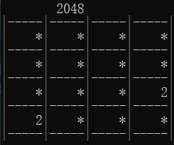
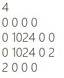

# 2021 程序设计Project文档

- 罗宇琦 [18307130255@fudan.edu.cn](mailto:18307130255@fudan.edu.cn) susu518518-
- 段欣然 [18307130295@fudan.edu.cn](mailto:18307130295@fudan.edu.cn) FluffyAnemone
- 黄蕙茹 [21210240198@m.fudan.edu.cn](mailto:21210240198@m.fudan.edu.cn) hhr1035048971

## 1 项目目标

本项目中，同学们需要使用C编程语言，结合课堂知识、lab内容，实现一个简单的、可以在命令行界面玩的2048小游戏，并按要求编写一份开发文档，介绍你的实现方式、开发思路等内容。

关于项目有任何疑问，可以在微信或通过邮件咨询。

## 2 项目需求

[2048](https://2048game.com/)的游戏任务是在一个网格上滑动小方块来进行组合，直到形成一个带有数字2048的方块或网格被方块占满无法移动为止。本项目需要大家通过自己所学实现一个自己的2048小游戏。在这个小游戏中，玩家可以通过命令行输入实现方块的上、下、左、右滑动，游戏支持存档读档等功能。下图是游戏Demo的一个例子。

## 3 项目实现

#### 3.1 网格的读取与输出

游戏的基础背景元素是网格，游戏需要在命令行输出每一次游戏状态。在存档时需要将当前网格所有数字的位置记录到文件中，读档时从文件中读出数字位置并复原保存的游戏状态。

本项目的网格大小应在代码文件开头使用`#define SIZE x`指定，在测试时会更改x的值，检查是否能支持在任意大小的网格上游玩（x无需考虑极端值，如大到超出内存上限等）

#### 3.1.1 网格的读取

网格中的元素只会有空格和数字两种，我们使用后缀为`.map`的文件来存储状态信息。

其中，首行代表网格大小，4即意味着存储的为4×4大小的网格。第二行开始记录数字位置信息，数字0代表空格，数字之间通过空格隔开。

#### 3.1.2 网格的输出

为了游戏界面的美观，输出网格图可以采用合适的可打印字符组成。

#### 3.2 游戏流程

#### 3.2.1 进入游戏

游戏启动后需要显示欢迎界面，在该界面询问玩家是否开始游戏或关闭游戏，玩家可以输入h查看游戏帮助信息

#### 3.2.2 读档界面

玩家选择开始游戏后，进入此界面，可以选择读入游戏存档或退回欢迎界面

#### 3.2.3 游戏运行

1. 游戏开始，正确显示网格。
2. 使用WASD来代表将所有方块向上、向左、向下、向右移动，每次可以选择上下左右其中一个方向去滑动，每滑动一次，所有的数字方块都会往滑动的方向靠拢，抵达其所能达到的网格边界。在方格滑动的过程中，两个相同数字的方块相撞后会合并为他们的和并靠拢。在网格上已有方块移动结束后，随机在网格四个方向中任一方向的任一空白边缘格生成一个新的2或者4的数字方块。如果网格上所有方块都没有改变位置，此时不会生成新的数字方块。
3. 当网格上的数字无法移动，即无论往哪个方向滑动网格上的数字方块都保持不变，不会移动时，进入游戏结束界面。
4. 当网格上出现2048这一数字方块时，进入游戏结束界面。
5. 游戏需要具有一定的健壮性，可以判别用户的非法输入，如果用户输入的是非法指令，要能够判别出并且给出提示语句。
6. 游戏过程中，用户可以通过输入q随时退出游戏，返回欢迎界面。
7. 游戏过程中，用户可以通过输入h随时查看帮助信息。
8. 游戏过程中，用户可以通过输入v保存当前游戏状态，保存完毕后需输出提示信息，如“保存成功”，此时用户仍可以继续当前的游戏（即存档这一行为不会导致退出游戏）；类似地，用户可以在玩游戏的中途输入l读取存档，读取完毕后需输出提示信息，如“读取成功”，此时网格状态将变为存档所保存的状态，之后用户可继续游戏。本项目只需要实现一个档位的存读档，如果存档文件中已保存了状态，此时用户再次存档则会覆盖原有的存档。

#### 3.2.4 游戏结束运行

游戏结束界面需要显示本轮游戏的得分，然后询问用户返回欢迎界面或关闭游戏。

## 4 项目评分

本项目满分100分，包括两个部分：基础功能部分、综合评价部分。其中，基础功能部分72分，综合评价部分28分。

#### 基础功能部分

| 说明                                                         | 分数 |
| :----------------------------------------------------------- | ---- |
| 正确绘制网格（能正确输出网格3分，能更改网格大小3分）         | 6    |
| 正确响应用户指令（上下左右移动20分，退出10分，帮助5分）      | 35   |
| 游戏结束判定（胜利判定5分，失败判定5分）                     | 10   |
| 游戏运行总体正常，符合相关描述，不会异常退出，没有内存泄漏   | 10   |
| 存读档功能（正常存读档无异常5分，能判断存读档文件有无非法字符3分，能检测有无存档文件3分） | 11   |
| 总分                                                         | 72   |

#### 综合评价部分

| 说明                                                         | 分数 |
| ------------------------------------------------------------ | ---- |
| 设计文档（包括但不限于程序结构设计与分析，主要函数的功能，简要描述如何使用你的程序，编程中遇到的问题和解决策略，Word 或者 PDF 格式） | 8    |
| 代码风格（包括但不限于命名规范，缩进与换行，代码可读性）     | 6    |
| 程序健壮性（对于玩家的非法输入，能够正确地处理和给予提示。比如玩家不按照系统的选项引导进行输入等） | 6    |
| 面试情况（能否清晰地解释程序结构，能否回答助教的问题等）     | 8    |
| 总分                                                         | 28   |

## 5 项目提交

1. 提交物：将你的源代码与设计文档进行打包，命名为学号\_姓名（如20302010000_王明），作为提交物。
2. 提交：提交至超星学习通对应的作业中。
3. 截止时间：暂定北京时间12月23号23:59。

## 6 注意事项

1. 认真做好每个功能点，特别是基础功能的实现。
2. 合理安排时间，尽早动手，不要拖到最后。
3. 本Project推荐使用IDE进行编写。
4. 注意代码风格（缩进、命名、函数设计等）符合规范。
5. 欢迎同学们相互讨论，但抄袭是严格禁止的。一旦发现抄袭行为，抄袭者和被抄袭者都根据抄袭量酌情扣分（甚至直接给予0分）。